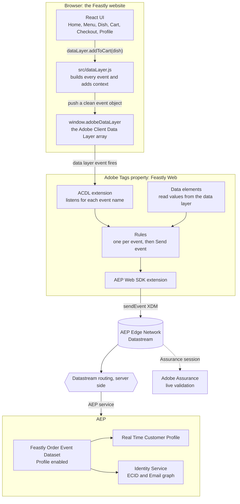
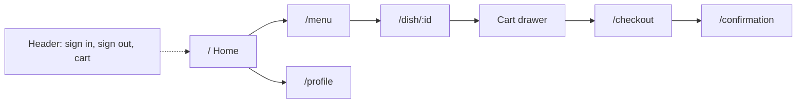
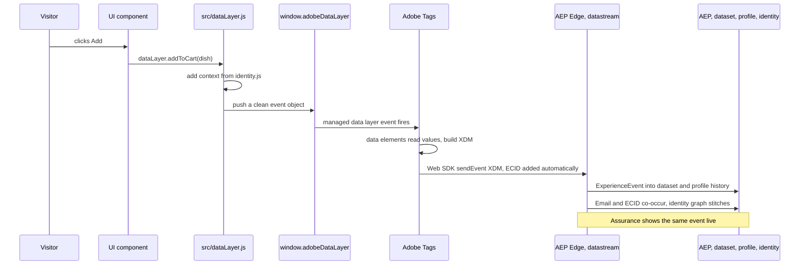
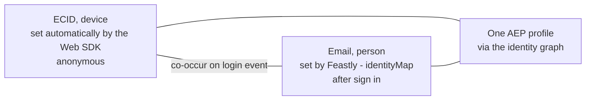

# Feastly: Data Collection to AEP, Complete Implementation Guide

This is the single reference for the Feastly demo. It explains why the project
exists, how the website is built, how the data layer works file by file, and how
the Adobe Data Collection stack ingests those events into Adobe Experience
Platform (AEP). Read it top to bottom and you can reproduce the whole
implementation on your own environment.

## Table of contents

1. The starting point: how we approached this build
2. What the project is and who it is for
3. Architecture at a glance
4. The website: how it is built
5. Project structure
6. The data layer, explained file by file
7. One event, traced end to end (Add to Cart)
8. Every other event follows the same path
9. Two implementation details worth knowing
10. The data collection implementation (the Adobe side)
11. End to end sequence
12. The identity model
13. Run, clone, deploy
14. Reusability: point it at your own Adobe org
15. Validate and troubleshoot
16. Glossary

---

## 1. The starting point: how we approached this build

Every real data collection project starts the same way. A customer has a
website, and they already know what they care about measuring: page views,
searches, add to cart, purchases, sign ins. The data comes first; the platform
configuration comes second.

We built Feastly the same way, in this deliberate order:

```
Step 1  Decide what happened on the site that is worth collecting
        (the list of events and the fields each one carries).
   >>
Step 2  Shape that into a data layer contract
        (the plain objects the website pushes: event name + fields).
   >>
Step 3  Design the XDM schema in AEP to receive exactly those fields.
   >>
Step 4  Wire Tags (data elements + rules) to map the data layer into that schema.
   >>
Step 5  Route it through a datastream into the AEP dataset, profile and identity.
```

The key idea: the data layer is the contract. Once you know what the website
will push, the schema is simply the receiving shape for that same data, and the
Tags configuration is the translation layer between the two. So the honest way
to read this document is data layer first (sections 6 to 9), then the Adobe
mapping that receives it (sections 10 to 12).

---

## 2. What the project is and who it is for

Feastly is a small food ordering website. A visitor browses a menu, searches,
opens a dish, adds it to the cart, signs in, checks out, pays, and rates the
order. Every one of those actions becomes a clean, schema shaped event in AEP.

It is built for practitioners who already know AEP but want to see the one step
upstream that they usually do not build themselves: how a click on a website
becomes an event, a profile, and an identity in AEP.

The teaching arc is deliberate:

1. Anonymous to known. A visitor starts anonymous, known only by an ECID. After
   sign in, the same person carries an Email identity, and AEP stitches the two
   into one profile. This is the single most common thing practitioners debug,
   and Feastly makes it happen on demand.
2. Events, profile and identity from one site. A single website produces the
   full picture: time series events, a real time profile, and an identity graph.
3. Reusable. A teammate clones the repo, pastes their own Tags embed URL into an
   in app config panel with no code edits, and instantly points Feastly at their
   own Adobe org.

---

## 3. Architecture at a glance

The whole system is one simple promise: the website never talks to Adobe
directly. It only pushes plain objects onto one array, `window.adobeDataLayer`.
Adobe Tags watches that array and does the rest.



One line mental model: the website is intentionally simple and only describes
what happened; all the shaping and routing happens inside Adobe.

The moving parts, and the only five you must remember:

| # | Component | Where | Role |
|---|-----------|-------|------|
| 1 | `window.adobeDataLayer` | created in `index.html` | the shared array, this is the data layer |
| 2 | Adobe Client Data Layer library | loaded in `index.html` | turns that array into an event emitting layer Tags can listen to |
| 3 | `src/dataLayer.js` | the website | the one file that builds every event and pushes it |
| 4 | Adobe Tags property | loaded by `src/adobe/loader.js` | listens, maps values to XDM, sends the event |
| 5 | Datastream then AEP | Adobe side | routes the event into the dataset, profile and identity graph |

---

## 4. The website: how it is built

The site is a standard React 18 application built with Vite and react-router. It
is an ordinary single page application; there is nothing Adobe specific in the UI
components beyond a single line per action that signals an event.

The route map is small:



Each screen triggers the events you would expect:

| Screen or action | Event produced |
|------------------|----------------|
| Home, Dish, Confirmation, Profile load | `pageView` |
| Menu load and category switch | `viewMenu` |
| Typing in menu search | `search` |
| Opening a dish | `dishView` |
| Add button | `addToCart` |
| Lowering quantity or removing a line | `removeFromCart` |
| Opening the cart drawer | `cartView` |
| Reaching checkout | `checkout` |
| Placing the order | `purchase` |
| Rating the order | `orderRating` |
| Sign in, sign up, save profile, newsletter, sign out | `login`, `signup`, `profileUpdate`, `newsletterSignup`, `logout` |

---

## 5. Project structure

```
aep-data-collection-food-demo/
  index.html                  inits window.adobeDataLayer, loads the ACDL library, mounts React
  src/
    main.jsx                  entry point; loadTags() then renders the app
    App.jsx                   routes
    dataLayer.js              THE DATA LAYER. all data collection code lives here
    adobe/
      identity.js             visitor id, session id, signed in user
      config.js               runtime Adobe config: Tags embed URL, datastream, org, sandbox
      loader.js               injects the Tags embed script at runtime from config
    CartContext.jsx           cart state; add, decrement and remove call the data layer
    components/
      Header.jsx              nav, cart, sign in and sign out (logout event)
      CartDrawer.jsx          cartView on open; plus and minus call add and remove
      DishCard.jsx            the Add button calls add()
      SignInModal.jsx         demo sign in and sign up; login and signup events
      AdobeConfigPanel.jsx    the footer panel to paste your own Tags embed URL
      Footer.jsx
    pages/                    Home, Menu, DishDetail, Checkout, Confirmation, Profile
    data/menu.js              static dish catalogue, no Adobe logic
  api/                        one time build tooling for the Adobe side, not imported by the site
  presentation/              the teaching deck
  SCHEMA.md, DATA-COLLECTION-SETUP.md, README.md
```

The important structural change in this build: all data layer code was
consolidated into a single file, `src/dataLayer.js`. The UI files no longer
contain any Adobe payload logic. They each call one method on the shared
`dataLayer` object.

---

## 6. The data layer, explained file by file

The one idea to hold onto: the data layer is just an array, and the website's
only job is to push clean objects onto it. Five files make that happen.

`index.html` creates the array and loads the library that makes it smart:

```js
window.adobeDataLayer = window.adobeDataLayer || [];
```

It then loads `@adobe/adobe-client-data-layer@2`, which upgrades that plain array
into an event emitting managed data layer. This is what lets the Tags ACDL
extension bind its listeners. Without this library, rules never fire.

`src/main.jsx` calls `loadTags()` before rendering, so the Tags library is ready
when React mounts. React StrictMode is deliberately left off, because in
development it runs effects twice, which would make every event fire twice.

`src/dataLayer.js` is the heart of the website side. It holds three things:

1. `getContext()` builds the site, device, visitor, session and user block that
   is attached to every event. This context is what lets AEP build the profile
   and stitch identity.
2. `push()` is a small serialized queue. It attaches the context and pushes the
   final object onto `window.adobeDataLayer`.
3. The exported `dataLayer` object exposes one method per event: `pageView`,
   `viewMenu`, `search`, `dishView`, `addToCart`, `removeFromCart`, `cartView`,
   `checkout`, `purchase`, `orderRating`, `login`, `signup`, `profileUpdate`,
   `newsletter`, `logout`.

`src/adobe/identity.js` stores who the visitor is using ordinary browser
storage: a persistent visitor id, a per session id, and the signed in user with
their profile attributes. `dataLayer.js` reads these getters when it assembles
the context. This file also holds `signIn`, `updateProfile` and `signOut`, which
are normal application state used by the UI, not tracking code.

`src/adobe/config.js` holds the runtime Adobe settings, primarily the Tags embed
URL. A teammate can override these from the footer config panel without touching
code; the values are stored in `localStorage`.

`src/adobe/loader.js` injects the Tags embed script at runtime using that config.
If no embed URL is set, the site still runs and logs every event to the console;
it simply does not send anything to Adobe.

---

## 7. One event, traced end to end (Add to Cart)

This is the single most useful thing to understand. Follow one click through
every file it touches.

Step 1. The UI only signals that something happened. In
`src/components/DishCard.jsx` the Add button calls `add()` from the cart:

```jsx
const { add } = useCart()
// ...
<button className="btn btn-primary btn-sm" onClick={() => add(dish, 1)}>Add +</button>
```

Step 2. The cart state lives in `src/CartContext.jsx`. When an item is added, it
updates React state and then calls the data layer. This is the moment the UI
hands off to the data layer:

```js
const add = useCallback((dish, qty = 1) => {
  setItems((prev) => { /* update cart state */ })
  dataLayer.addToCart(dish, qty)   // hand off to src/dataLayer.js
}, [])
```

Step 3. Control moves into `src/dataLayer.js`. The `addToCart` method shapes the
event and calls the shared `push()`:

```js
addToCart(dish, qty = 1) {
  push({
    event: 'addToCart',
    commerce: { productListAdds: { value: 1 } },
    product: productItem(dish, qty),
    food:    { category: dish.category, cuisine: dish.cuisine },
  })
}
```

Step 4. Still in `src/dataLayer.js`, `push()` attaches the context. It calls
`getContext()`, which in turn reads the visitor, session and user from
`src/adobe/identity.js`, then pushes the final object onto the array:

```js
function push(payload) {
  window.adobeDataLayer = window.adobeDataLayer || []
  queue.push({
    event: payload.event,
    eventInfo: { timestamp: new Date().toISOString() },
    ...getContext(),           // reads src/adobe/identity.js
    ...payload,
  })
  if (!draining) drain()       // drain() calls window.adobeDataLayer.push(...)
}
```

The object that lands on `window.adobeDataLayer` looks like this:

```js
{
  event: "addToCart",
  eventInfo: { timestamp: "2026-..." },
  site: { brand: "Feastly", ... },
  device: { type: "desktop", ... },
  visitor: { id: "v-...", type: "returning" },
  session: { id: "s-..." },
  user: { authenticated: false },
  commerce: { productListAdds: { value: 1 } },
  product: { id: "...", name: "...", price: 12.5, quantity: 1, priceTotal: 12.5 },
  food: { category: "...", cuisine: "..." }
}
```

Step 5. The website's job is now done. Adobe Tags, which has been listening on
`window.adobeDataLayer`, takes over: a rule named for the `addToCart` event
fires, data elements read the values, the XDM object is assembled, and the Web
SDK sends the event to the datastream and on to AEP. No website code runs from
this point forward.

The file path of one Add to Cart click, in order:

```
DishCard.jsx  >>  CartContext.jsx  >>  dataLayer.js (addToCart)
   >>  dataLayer.js (push and getContext)  >>  identity.js (context getters)
   >>  window.adobeDataLayer  >>  Adobe Tags  >>  Datastream  >>  AEP
```

---

## 8. Every other event follows the same path

Add to Cart is not special. Every event in the application follows the exact
same three part shape: a UI file signals the event with one line, a method in
`src/dataLayer.js` shapes it, and the shared `push()` adds context and pushes it
onto the array. Only the payload differs.

| UI trigger (file) | Method in dataLayer.js | event name pushed |
|-------------------|------------------------|-------------------|
| Home, DishDetail, Confirmation, Profile page load | `dataLayer.pageView(name)` | `pageView` |
| Menu load and category switch (`pages/Menu.jsx`) | `dataLayer.viewMenu(cat)` | `viewMenu` |
| Menu search input (`pages/Menu.jsx`) | `dataLayer.search(...)` | `search` |
| Opening a dish (`pages/DishDetail.jsx`) | `dataLayer.dishView(dish)` | `dishView` |
| Add button (`CartContext.jsx`) | `dataLayer.addToCart(dish)` | `addToCart` |
| Remove or lower quantity (`CartContext.jsx`) | `dataLayer.removeFromCart(dish)` | `removeFromCart` |
| Open cart drawer (`components/CartDrawer.jsx`) | `dataLayer.cartView(items)` | `cartView` |
| Reach checkout (`pages/Checkout.jsx`) | `dataLayer.checkout(items)` | `checkout` |
| Place order (`pages/Checkout.jsx`) | `dataLayer.purchase(order)` | `purchase` |
| Rate order (`pages/Confirmation.jsx`) | `dataLayer.orderRating(...)` | `orderRating` |
| Sign in (`components/SignInModal.jsx`) | `dataLayer.login(user)` | `login` |
| Sign up (`components/SignInModal.jsx`) | `dataLayer.signup(user)` | `signup` |
| Save profile (`pages/Profile.jsx`) | `dataLayer.profileUpdate(user)` | `profileUpdate` |
| Newsletter opt in (`pages/Profile.jsx`) | `dataLayer.newsletter(...)` | `newsletterSignup` |
| Sign out (`components/Header.jsx`) | `dataLayer.logout()` | `logout` |

So once you understand the Add to Cart trace, you understand all fifteen events.
To read any of them, open `src/dataLayer.js` and find the matching method. The
`event` name in the right column is exactly what an Adobe Tags rule listens for,
which is the handshake between the website and Adobe.

---

## 9. Two implementation details worth knowing

These two behaviours in `src/dataLayer.js` are the only non obvious parts, and
they exist for good reasons.

First, events are queued and released roughly 300 milliseconds apart. The Adobe
Client Data Layer processes pushes asynchronously and merges them, so firing
several events in the same instant can let one event's data leak into the next.
The queue releases them one at a time so each hit is clean.

Second, transient branches are cleared between events. Before each event the code
resets `commerce`, `product`, `order`, `search`, `rating`, `food` and
`authentication` to undefined, so a purchase does not carry over into the next
page view. The `page` branch is deliberately not reset, so the current page name
stays attached to every following event.

---

## 10. The data collection implementation (the Adobe side)

This is the section that maps the data layer into AEP. Everything above was the
website producing events; everything here is Adobe receiving them. This is the
part a practitioner reproduces in their own org.

### 10.1 Environment and identifiers

| Item | Value |
|------|-------|
| Org | AEP Support, `B504732B5D3B2A790A495ECF@AdobeOrg` |
| Sandbox | `princeparvat-prod`, region VA7 |
| Tenant namespace | `_aepsupport` |
| Datastream ID | `5a439dcd-2363-46fb-a17d-bbceb3cb9f54` |
| Tags company | `CO3fbcffe0934b41c28555bf865750d8cf` |
| Tags property | Feastly Web, `PR00054be9b3d6446e8d10f6e408021932` |
| Tags environment | `EN4344fff38c5741f98299de468ac12527`, Development |
| Tags embed, default in code | `https://assets.adobedtm.com/6a203c8a0ff8/78e6bd588c19/launch-157221773b3c-development.min.js` |
| Live site | `https://feastly-prince.netlify.app` |

### 10.2 Step one, the schema

The schema is the receiving shape for the data layer. Create a schema named
`Feastly Order Event` on the XDM ExperienceEvent class, then add field groups
that match what the website pushes.

Standard field groups:

- AEP Web SDK ExperienceEvent, which provides `web`, `environment`, `device`,
  `placeContext`, `identityMap`, `timestamp` and `eventType`.
- Commerce Details, which provides `commerce` (productViews, productListAdds,
  productListRemovals, productListOpens, productListViews, checkouts, purchases,
  order) and `productListItems`.

Custom field group `Feastly Details` under the `_aepsupport` tenant:

- `food`: `category`, `cuisine`, `veg` (boolean), `spiceLevel`.
- `attributes`: `loyaltyTier`, `dietaryPreference`, `favoriteCuisine`, `city`,
  `marketingConsent` (boolean), `firstName`, `visitorType`.
- `rating`: `orderId`, `stars` (integer), `comment`.

Mark Email as an identity field, namespace Email. The full field reference lives
in `SCHEMA.md`.

A nuance worth teaching: the `attributes` object travels on the events. It
populates event history and is queryable, but it does not become profile record
attributes. To show attributes on the profile Attributes tab you would add a
separate Individual Profile record schema and dataset. That is out of scope here
but is a good next step talking point.

### 10.3 Step two, the dataset

Create a dataset named `Feastly Order Event Dataset` from that schema and enable
it for Profile. Enabling Profile is what makes events build real time profiles
and feed the identity graph.

| Purpose | Name | ID |
|---------|------|----|
| Event schema | `Feastly Order Event` | `.../schemas/7eea5989503ed61e205aa444ff7706dee2b4364afa2e0349` |
| Custom field group | `Feastly Details` | `.../mixins/de1f80a51ff61f580acb3509e21ba47a23f5042d8bd6b081` |
| Dataset | `Feastly Order Event Dataset` | `6ab930db686f67f6f0497a9e`, Profile enabled |

### 10.4 Step three, the datastream

Create a datastream named `Feastly Web SDK`, add the Adobe Experience Platform
service, and select the dataset above. Copy the datastream ID. The datastream is
the server side routing configuration at the Edge that decides which Adobe
services receive each event.

### 10.5 Step four, the Tags property

The Tags property is the translation layer. It listens to the data layer, reads
values, builds XDM, and sends the event.

Extensions:

- Core.
- Adobe Experience Platform Web SDK, instance `alloy`, configured with the
  datastream and Org ID.
- Adobe Client Data Layer, with `dataLayerName` set to `adobeDataLayer`.

A key gotcha: the ACDL Tags extension does not inject the ACDL library. It
expects the site to load it. Feastly loads `@adobe/adobe-client-data-layer@2` in
`index.html` so the data layer becomes event emitting and the extension
listeners actually bind. Without it, rules never fire.

Data elements read one value each from the data layer and are reused across
rules: `Feastly - page name`, `Feastly - commerce`, `Feastly - product`,
`Feastly - order`, `Feastly - food`, `Feastly - search`, `Feastly - rating`,
`Feastly - user`, plus custom code elements `Feastly - productListItems` and
`Feastly - identityMap`, and the assembling `Feastly - XDM` object.

The pattern for every rule is the same. The event is the ACDL Data Pushed event,
listening for one specific data layer key. The action is the Web SDK Send event,
with `xdm` set to `%Feastly - XDM%` and a fixed `type`, which is the XDM
eventType.

The single most important teaching point: the rule event listens for the
camelCase data layer name, for example `pageView`. The action type is the dotted
XDM eventType, for example `web.webpagedetails.pageViews`. Mixing these two up is
the classic rule not firing or wrong eventType bug.

### 10.6 Rules to eventType map

| Rule | Data layer key | XDM eventType |
|------|----------------|---------------|
| Feastly - Page View | `pageView` | `web.webpagedetails.pageViews` |
| Feastly - View Menu | `viewMenu` | `web.webpagedetails.pageViews` |
| Feastly - Search | `search` | `commerce.productListViews` |
| Feastly - Dish View | `dishView` | `commerce.productViews` |
| Feastly - Add To Cart | `addToCart` | `commerce.productListAdds` |
| Feastly - Cart View | `cartView` | `commerce.productListOpens` |
| Feastly - Remove From Cart | `removeFromCart` | `commerce.productListRemovals` |
| Feastly - Checkout | `checkout` | `commerce.checkouts` |
| Feastly - Purchase | `purchase` | `commerce.purchases` |
| Feastly - Order Rating | `orderRating` | `web.webinteraction.linkClicks` |
| Feastly - Login | `login` | `userAccount.login` |
| Feastly - Signup | `signup` | `userAccount.signup` |
| Feastly - Profile Update | `profileUpdate` | `userAccount.profileUpdate` |
| Feastly - Newsletter | `newsletterSignup` | `userAccount.newsletterSignup` |
| Feastly - Logout | `logout` | `userAccount.logout` |

Notice the direct line from section 8 to this table. The `event` name the
website pushes is the same key a rule listens for. That column is the contract
between the two halves of the system.

---

## 11. End to end sequence

This ties the website and the Adobe side into a single path for one event.



---

## 12. The identity model

This is the payoff of the whole demo.



Before sign in the visitor is only an ECID, managed by the Web SDK and the Edge.
On sign in, the `Feastly - identityMap` data element adds Email as a person
identity, primary and authenticated. The Web SDK adds the ECID automatically.
Because both appear together in the same event identityMap, the AEP identity
graph links them, and the anonymous history and the known profile become one.

The identityMap is Email only from code; the ECID is left to the Edge. This is
the safe, standard pattern and avoids identity graph risk.

---

## 13. Run, clone, deploy

```bash
npm install
npm run dev     # http://localhost:5175
npm run build   # production build into dist/
```

The site runs immediately in data layer only mode. Every event logs to the
console and pushes to `window.adobeDataLayer`, which is ideal for walking through
the flow before Adobe is wired up. Deploy is handled by Netlify, with
`netlify.toml` and `public/_redirects` handling single page app routing.

The `api/` scripts are one time tooling that built the Adobe side through the
Schema Registry, Catalog and Reactor APIs. They require OAuth server to server
credentials, are never committed with secrets, and are not imported by the
running site.

---

## 14. Reusability: point it at your own Adobe org

Feastly runs data layer only until a Tags embed URL is set. The footer Adobe
Config panel lets a teammate paste their own Tags embed URL, which is stored in
`localStorage` and injected at runtime by `loader.js` with no code edits. Build
time defaults can also be provided through `VITE_TAGS_EMBED_URL`,
`VITE_DATASTREAM_ID`, `VITE_ORG_ID` and `VITE_SANDBOX`. This is what makes the
demo reusable: everyone clones the same repo and points it at their own property.

---

## 15. Validate and troubleshoot

Validate in three places:

1. Console. Every action logs `[Feastly][dataLayer] <event>` with the payload.
   Type `adobeDataLayer.getState()` to see the merged state.
2. Assurance. Connect a session and watch the ACDL event, then the rule firing,
   then the Web SDK sendEvent, then the Edge response.
3. AEP. Use the dataset preview, and look up a profile by identity to see the
   profile, event history and the identity graph linking ECID and Email.

Issues seen during this build and how they were resolved:

- Rules never fired because the ACDL Tags extension does not inject the ACDL
  library. Fixed by loading the ACDL library in `index.html`.
- ActivityMap link click noise was about 57 percent of calls. Disabled
  `clickCollectionEnabled` on the Web SDK extension.
- Commerce events were missing `pageName`. Stopped resetting the `page` branch
  between events so it persists.
- Menu fired two page views. Removed the duplicate page view and kept the menu
  view event.
- login, signup and similar shared one generic eventType. Gave them distinct
  `userAccount.*` eventTypes.
- Identity stitching appeared broken and produced two profiles. This was not a
  site bug. The dataset Profile and Identity toggles were enabled seconds before
  the events, so that first burst landed in the lake but not in Profile. Re
  running after propagation stitched cleanly.
- Checkout allowed anonymous orders. Added a sign in gate so every order is tied
  to a known identity.

---

## 16. Glossary

- ACDL, Adobe Client Data Layer. The `window.adobeDataLayer` array. The site
  pushes; Tags forwards.
- Data element. A named variable in Tags that reads one value from the data
  layer, reused across rules and in the XDM object.
- Rule. Event, optional condition, action. Feastly rules skip the condition:
  on an event, Send event.
- Datastream. Server side routing configuration at the Edge that decides which
  Adobe services receive the event.
- ECID and Email. Device identity set automatically, and person identity set
  after sign in. Their co-occurrence stitches them into one profile.
- Profile enabled dataset. An event dataset whose data flows into Real Time
  Customer Profile and Identity Service.
- Assurance. The live validation tool that shows events leaving the browser and
  the Edge response.

---

This document is the single source for the Feastly implementation. The companion
teaching deck lives in `presentation/Feastly-DataCollection-to-AEP.pptx`, and the
field level schema reference lives in `SCHEMA.md`.
