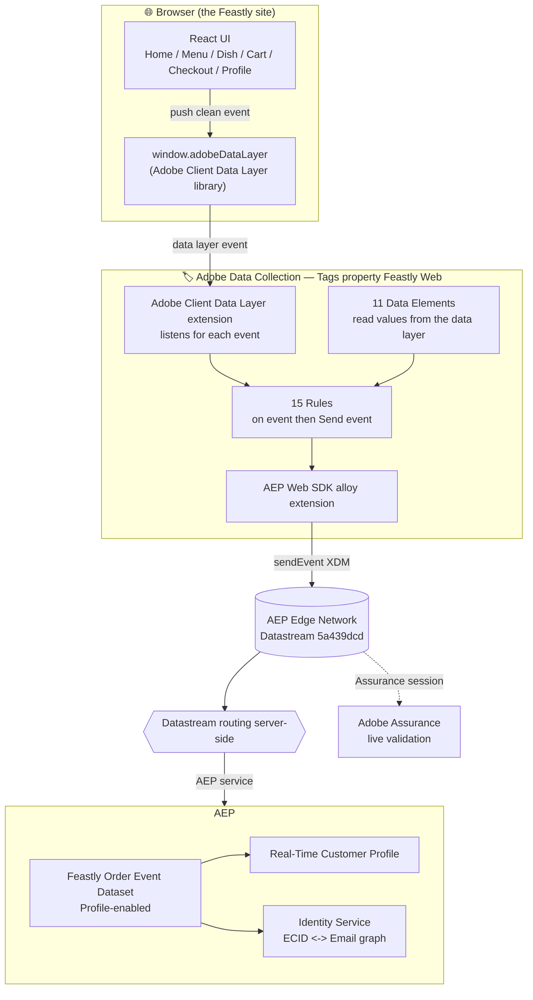
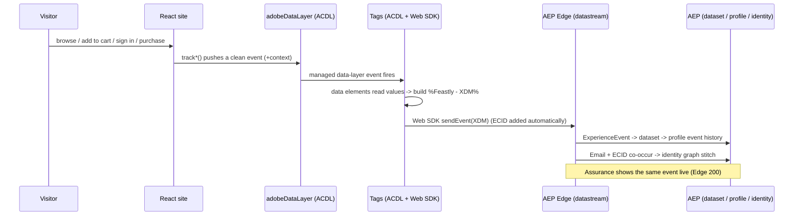
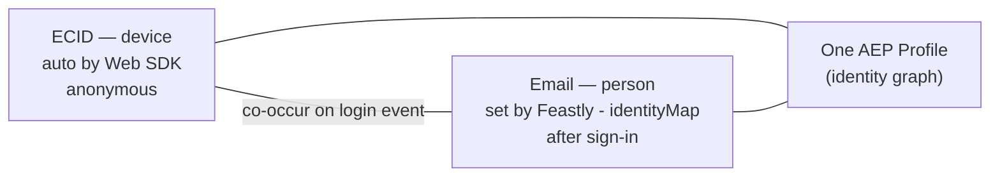

# Feastly 🍔 — Data Collection → AEP: Complete Architecture & Handoff

> **What this project is:** a small, beautiful food-ordering website built for **one purpose** — to teach the AEP support team how website data actually reaches **Adobe Experience Platform** through **Adobe Data Collection (Tags/Launch + Web SDK + Datastream)**. The team already knows AEP; this shows them the one step *upstream* they usually don't see: how a click on a website becomes an event, a profile, and an identity in AEP.
>
> **How to read this doc:** Section 1–4 explain the idea and the moving parts. Sections 5–9 are the exact build (schema, datastream, Tags property, data elements, rules) with real IDs. Section 10 is the data flow end-to-end. Sections 11–14 cover identity, the reusable config, running/cloning, and troubleshooting. Everything here reflects the **live, working** build in sandbox `princeparvat-prod`.

---

## 1. OBJECTIVE & THE STORY IT TELLS

Feastly is a fake food-delivery brand. A visitor browses a menu, searches, opens a dish, adds to cart, signs in, checks out, pays, and rates the order. **Every one of those actions becomes a clean, schema-shaped event in AEP.**

The teaching arc:

1. **Anonymous → Known.** A visitor starts anonymous (only an ECID). After sign-in, the same person carries an Email identity, and AEP **stitches** the two into one profile. This is the single most common thing support debugs — Feastly makes it happen on demand.
2. **Events + Profile + Identity.** One website produces the full picture: time-series events, a real-time profile, and an identity graph.
3. **Reusable.** A teammate clones the repo, pastes their **own** Tags embed URL into an in-app config panel (no code edits), and instantly points Feastly at their own Adobe org to learn hands-on.

---

## 2. ARCHITECTURE (big picture)



**One-line mental model:** *the website is dumb and just describes what happened; all the shaping and routing happens in Adobe.*

---

## 3. COMPONENTS IN PLAY

| Layer | Component | Role |
|---|---|---|
| Site | **React 18 + Vite** | UI + a thin tracking library (`src/adobe/*`) |
| Data layer | **Adobe Client Data Layer (ACDL)** library (CDN v2) | turns `window.adobeDataLayer` into an event-emitting managed layer |
| Collection | **Tags / Launch property "Feastly Web"** | extensions + data elements + rules that read the data layer and send events |
| Collection | **AEP Web SDK (alloy) extension** | sends XDM to the Edge; auto-manages ECID |
| Collection | **ACDL extension** | listens to the managed data layer, triggers rules |
| Transport | **Datastream** `5a439dcd…` | server-side routing config; forwards to AEP |
| Platform | **AEP** — schema, dataset, Real-Time Profile, Identity Service | stores events, builds profiles, stitches identities |
| Validation | **Adobe Assurance** | watch events leave the browser and reach the Edge |

---

## 4. ENVIRONMENT, IDS & CONFIGURATION (source of truth)

| Item | Value |
|---|---|
| Org | **AEP Support** — `B504732B5D3B2A790A495ECF@AdobeOrg` |
| Sandbox | **princeparvat-prod** — region VA7 |
| Tenant namespace | `_aepsupport` |
| Datastream ID | `5a439dcd-2363-46fb-a17d-bbceb3cb9f54` |
| Tags company | `CO3fbcffe0934b41c28555bf865750d8cf` (AEP Support) |
| Tags property | **Feastly Web** — `PR00054be9b3d6446e8d10f6e408021932` |
| Tags environment | `EN4344fff38c5741f98299de468ac12527` (Development) |
| Tags embed (default in code) | `https://assets.adobedtm.com/6a203c8a0ff8/78e6bd588c19/launch-157221773b3c-development.min.js` |
| Merge policy | `fd629cfe-…` (Default Timebased, active on edge) |
| Live site | `https://feastly-prince.netlify.app` |

**Schema & dataset (created via API):**

| Purpose | Name | ID | Class |
|---|---|---|---|
| Event schema | `Feastly Order Event` | `…/schemas/7eea5989503ed61e205aa444ff7706dee2b4364afa2e0349` | XDM ExperienceEvent |
| Custom field group | `Feastly Details` | `…/mixins/de1f80a51ff61f580acb3509e21ba47a23f5042d8bd6b081` | — |
| Dataset | `Feastly Order Event Dataset` | `6ab930db686f67f6f0497a9e` | Profile-enabled |

**Identity namespaces:** `ECID` (device, auto by Web SDK), `Email` (person). The API/Glass namespace code is **`Email`** (capitalized).

> **The entire Data Collection stack was built via API**, not the UI — Schema Registry/Catalog API for the schema + dataset, and the **Reactor API** for the property, extensions, 11 data elements, 15 rules, library and build. Scripts live in `api/` and IDs in `api/aep-resources.json` + `api/reactor-resources.json`. The datastream itself was created in the UI (the datastream config endpoint was not reachable with the available entitlements).

---

## 5. REPOSITORY & CODE

```
aep-data-collection-food-demo/
├─ index.html                 # inits window.adobeDataLayer + loads the ACDL library + mounts React
├─ src/
│  ├─ main.jsx                # entry; loadTags() then renders the app (StrictMode off to avoid double events)
│  ├─ App.jsx                 # routes
│  ├─ adobe/
│  │  ├─ track.js             # THE DATA LAYER. every track*() builds + pushes one event
│  │  ├─ identity.js          # visitor/session/user + getContext() merged into every event
│  │  ├─ config.js            # runtime Adobe config (Tags embed URL, datastream, org, sandbox)
│  │  └─ loader.js            # injects the Tags embed <script> at runtime from config
│  ├─ CartContext.jsx         # cart state; add()/decrement()/remove() fire commerce events
│  ├─ components/
│  │  ├─ Header.jsx           # nav, cart, sign-in/out (logout fires trackLogout)
│  │  ├─ CartDrawer.jsx       # cartView on open; +/- fire add/remove
│  │  ├─ DishCard.jsx         # "Add +" fires addToCart
│  │  ├─ SignInModal.jsx      # demo sign-in/up; fires login/signup, sets Email identity
│  │  ├─ AdobeConfigPanel.jsx # the ⚙ footer panel to paste your own Tags embed URL
│  │  └─ Footer.jsx
│  ├─ pages/                  # Home, Menu, DishDetail, Checkout, Confirmation, Profile
│  └─ data/menu.js            # static dish catalogue (no Adobe logic)
├─ api/                       # one-time build tooling (NOT imported by the site)
│  ├─ create_schema.mjs       # Schema Registry + Catalog: schema, field group, dataset
│  ├─ reactor_build.mjs       # property + extensions
│  ├─ reactor_build2.mjs      # 11 data elements + 13 rules
│  ├─ reactor_build7.mjs      # efficiency pass: distinct userAccount.* eventTypes + Cart View rule
│  ├─ add_logout_rule.mjs     # Feastly - Logout rule (userAccount.logout)
│  ├─ reactor_relink.mjs      # revise resources + rebuild library
│  ├─ revert_identitymap.mjs  # identityMap back to Email-only (ECID left to the Edge)
│  ├─ aep-resources.json      # schema / field group / dataset IDs
│  └─ reactor-resources.json  # company / property / datastream / embed IDs
├─ presentation/              # the teaching deck (pptxgenjs generator + screenshots)
└─ SCHEMA.md · DATA-COLLECTION-SETUP.md · README.md
```

### The data layer (`src/adobe/track.js`)
The only file that writes to `window.adobeDataLayer`. Each function builds one event object and pushes it. A short serialized queue (300 ms gap) keeps events ordered, and transient branches (`commerce`, `product`, `order`, `search`, `rating`, `food`, `authentication`) are reset between events so metrics never accumulate — `page` is deliberately **not** reset so `pageName` persists across events.

Every event carries a `context` block from `identity.js` (`site`, `device`, `visitor`, `session`, `user`). Tracked functions:

`trackPageView`, `trackViewMenu`, `trackSearch`, `trackDishView`, `trackAddToCart`, `trackRemoveFromCart`, `trackCartView`, `trackCheckout`, `trackPurchase`, `trackOrderRating`, `trackLogin`, `trackSignup`, `trackProfileUpdate`, `trackNewsletter`, `trackLogout`.

---

## 6. TAGS (LAUNCH) IMPLEMENTATION — property "Feastly Web"

**Extensions (3):**
- **Core** (`core`)
- **Adobe Experience Platform Web SDK** (`adobe-alloy`) — instance `alloy`, configured with the datastream + Org ID.
- **Adobe Client Data Layer** (`gcoe-adobe-client-data-layer`) — `dataLayerName = adobeDataLayer`.

> ⚠️ **Key gotcha (cost us a debugging session):** the ACDL Tags extension does **not** inject the ACDL library — it expects the *site* to load it. Feastly loads `@adobe/adobe-client-data-layer@2` in `index.html` so `window.adobeDataLayer` becomes event-emitting and the extension's listeners actually bind. Without it, rules never fire.

**Data Elements (11):** `Feastly - page name`, `Feastly - commerce`, `Feastly - product`, `Feastly - order`, `Feastly - food`, `Feastly - search`, `Feastly - rating`, `Feastly - user` (data-layer computed state), `Feastly - productListItems` (custom code), `Feastly - identityMap` (custom code), `Feastly - XDM` (XDM object that assembles the final payload).

**The pattern for every rule:** *Event* = ACDL "Data Pushed" listening for a specific data-layer key → *Action* = Web SDK "Send event" with `xdm = %Feastly - XDM%` and a fixed `type` (the XDM eventType).

> **The #1 teaching point:** the **Event** listens for the camelCase data-layer name (e.g. `pageView`); the **Action type** is the dotted XDM `eventType` (e.g. `web.webpagedetails.pageViews`). Mixing these up is the classic "rule not firing / wrong eventType" bug.

---

## 7. RULES → eventType MAP (15 rules)

| Rule | Data-layer key | XDM `eventType` |
|---|---|---|
| Feastly - Page View | `pageView` | `web.webpagedetails.pageViews` |
| Feastly - View Menu | `viewMenu` | `web.webpagedetails.pageViews` |
| Feastly - Search | `search` | `commerce.productListViews` |
| Feastly - Dish View | `dishView` | `commerce.productViews` |
| Feastly - Add To Cart | `addToCart` | `commerce.productListAdds` |
| Feastly - Cart View | `cartView` | `commerce.productListOpens` |
| Feastly - Remove From Cart | `removeFromCart` | `commerce.productListRemovals` |
| Feastly - Checkout | `checkout` | `commerce.checkouts` |
| Feastly - Purchase | `purchase` | `commerce.purchases` |
| Feastly - Order Rating | `orderRating` | `web.webinteraction.linkClicks` |
| Feastly - Login | `login` | `userAccount.login` |
| Feastly - Signup | `signup` | `userAccount.signup` |
| Feastly - Profile Update | `profileUpdate` | `userAccount.profileUpdate` |
| Feastly - Newsletter | `newsletterSignup` | `userAccount.newsletterSignup` |
| Feastly - Logout | `logout` | `userAccount.logout` |

---

## 8. XDM SCHEMA (SDR)

**Schema `Feastly Order Event`** (class = XDM ExperienceEvent).

**Standard field groups:**
- **AEP Web SDK ExperienceEvent** → `web`, `environment`, `device`, `placeContext`, `identityMap`, `timestamp`, `eventType`.
- **Commerce Details** → `commerce` (productViews, productListAdds, productListRemovals, productListOpens, productListViews, checkouts, purchases, order) + `productListItems[]`.

**Custom field group `Feastly Details`** (under `_aepsupport`):
- `food` — `category`, `cuisine`, `veg` (bool), `spiceLevel`
- `attributes` — `loyaltyTier`, `dietaryPreference`, `favoriteCuisine`, `city`, `marketingConsent` (bool), `firstName`, `visitorType`
- `rating` — `orderId`, `stars` (int), `comment`

**Dataset:** `Feastly Order Event Dataset`, **Profile-enabled** so events build real-time profiles and feed the identity graph.

> **Attributes vs events (important nuance we verified live):** the `attributes` object travels *on the events* — it populates event history and is queryable, but it does **not** become profile *record* attributes. To show attributes on the profile "Attributes" tab you'd add a separate **Individual Profile (record)** schema + dataset. Out of scope for this demo, but a great "next level" talking point.

---

## 9. DATA FLOW (sequence)



---

## 10. IDENTITY MODEL (the payoff)



- Before sign-in the visitor is only an **ECID** (managed by the Web SDK / Edge).
- On sign-in, the `Feastly - identityMap` data element adds **Email** (person, primary, authenticated). The Web SDK adds the **ECID** automatically. Because both appear together in the same event's `identityMap`, AEP's identity graph links them → the anonymous history and the known profile become **one**.
- **identityMap is Email-only from code; ECID is left to the Edge** (the safe, standard pattern — avoids identity-graph risk).

> Verified live this project: an anonymous ECID event + signed-in Email events stitched into a single profile with a 2-ECID + 1-Email identity graph, sourced from the Feastly dataset.

---

## 11. REUSABILITY — the in-app Adobe Config panel

Feastly runs **data-layer-only** until a Tags embed URL is set. The footer **⚙ Adobe Config** panel (`AdobeConfigPanel.jsx`) lets a teammate paste their **own** Tags embed URL; it's stored in `localStorage` and injected at runtime by `loader.js` — **zero code edits**. Defaults (in `config.js`) point at the shared demo property so it works out of the box, and can also be overridden at build time via `VITE_TAGS_EMBED_URL` / `VITE_DATASTREAM_ID` / `VITE_ORG_ID` / `VITE_SANDBOX`.

---

## 12. RUN / CLONE / DEPLOY

```bash
npm install
npm run dev     # http://localhost:5175
npm run build   # production build -> dist/
```

- **Point it at your Adobe org:** open the site → footer ⚙ → paste your Tags embed URL. (Or set `VITE_*` env vars before building.)
- **Deploy:** Netlify (`netlify.toml` + `public/_redirects` handle SPA routing). Live demo: `https://feastly-prince.netlify.app`.
- **Rebuild the Adobe stack via API:** the `api/*.mjs` scripts require OAuth Server-to-Server creds (never commit secrets). They are one-time tooling; the running site does not import them.

---

## 13. PROBLEMS ENCOUNTERED & HOW WE SOLVED THEM

- **Rules never fired at runtime** (only auto ActivityMap link-clicks on `/collect`, 204). Root cause: the ACDL Tags extension doesn't inject the ACDL library. **Fix:** load `@adobe/adobe-client-data-layer@2` in `index.html` so `window.adobeDataLayer` is event-emitting. (Real rule events go via `/interact`, 200; 204 on `/collect` is normal fire-and-forget.)
- **ActivityMap link-click noise** (~57% of calls) → disabled `clickCollectionEnabled` on the Web SDK extension.
- **Commerce events missing `pageName`** → stopped resetting the `page` branch between events so it persists.
- **Menu fired two page views** → removed the duplicate `trackPageView`, kept `trackViewMenu`.
- **login/signup/etc. all shared `web.webinteraction.linkClicks`** → gave them distinct `userAccount.*` eventTypes (`reactor_build7.mjs`).
- **No `cartView` event** → added the `Feastly - Cart View` rule (`commerce.productListOpens`).
- **Netlify 404 on hard refresh** of a route → added `public/_redirects` (`/* /index.html 200`) + `netlify.toml`.
- **Reactor API 403/404** during the API build → had to add the Data Collection API to the AEP credential's Developer Console project + add its technical account to a Data Collection product profile; Reactor needs `Accept: application/vnd.api+json;revision=1`, resources must be **revised** before a library build.
- **Identity stitching "not working"** (two profiles) → NOT a site bug: the dataset's Profile/Identity toggles were enabled seconds before the events, so that burst landed in the lake but not in Profile/Identity. Re-running after propagation stitched cleanly.
- **Checkout allowed anonymous orders** → added a sign-in gate to the checkout page (order tied to a known identity).

---

## 14. GLOSSARY

- **ACDL** — Adobe Client Data Layer; `window.adobeDataLayer`. The site pushes; Tags forwards.
- **Data Element** — a named variable in Tags that reads one value from the data layer; reused across rules and in the XDM object.
- **Rule** — *Event → (Condition) → Action*. Feastly's rules skip the condition: *on <event> → Send event*.
- **Datastream** — server-side routing config at the Edge; decides which Adobe services receive the event.
- **ECID / Email** — device identity (auto) / person identity (after sign-in). Co-occurrence stitches them.
- **Profile-enabled dataset** — an event dataset whose data flows into Real-Time Customer Profile + Identity Service.
- **Assurance** — live validation tool showing events leaving the browser and the Edge response.

---

*End of Feastly architecture handoff. The companion teaching deck lives in `presentation/Feastly-DataCollection-to-AEP.pptx`.*
